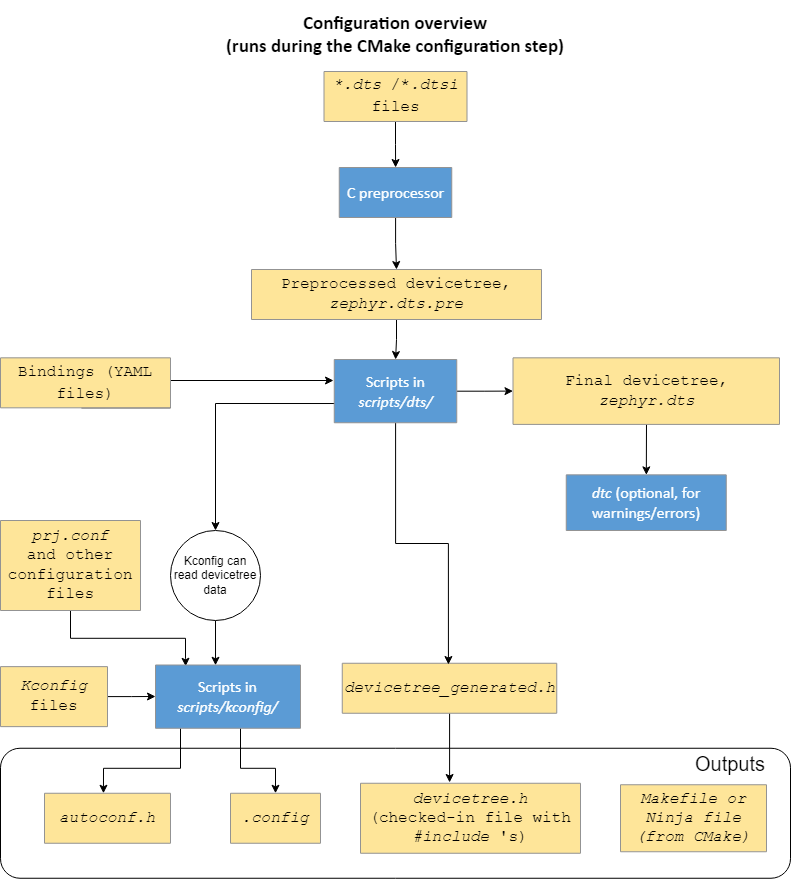

# Instructions for Kconfig Demo


## Kconfig repetition

Kconfig (Kernel Config) is a configuration system (coming from Linux). Used to configure your application by e.g enabling/disabling features, setting default/min/max values, setting ranges, etc. But it is also used by CMake to e.g include or exclude files from the build process. This allows you to modify your application without modifying the source code.

In zephyr the main configuration file for configuration is **prj.conf**.

Here is an example of a **prj.conf** file from the ncs sample **peripheral_lbs** (peripheral led button service), a simple BLE application:

```shell
CONFIG_NCS_SAMPLES_DEFAULTS=y

CONFIG_BT=y
CONFIG_BT_PERIPHERAL=y
CONFIG_BT_DEVICE_NAME="Nordic_LBS"

# Enable the LBS service
CONFIG_BT_LBS=y
CONFIG_BT_LBS_POLL_BUTTON=y
CONFIG_DK_LIBRARY=y

CONFIG_SYSTEM_WORKQUEUE_STACK_SIZE=2048
```
The syntax:
- A config option needs to be prefixed with `CONFIG_`
- Spaces surrounding `=` is not allowed
- Comments are made by `#`

As you can see there are three data types used above:
- bool (=y)
- string (="Nordic_LBS")
- int (=2048)

Don't think I have seen any other type, but there might be.

To be able to use a `CONFIG_*` option in a prj.conf file it needs to be defined in a **Kconfig** file. Kconfig files are always named **Kconfig** and sometimes suffixed with something describing: **Kconfig.security**, **Kconfig.nrf**.


## Hello world - `CONFIG_PRINTK` example

`printk` (similar to `printf`) is zephyr's simplest way of printing output to the console, through UART.

Let's begin with building and flashing the Hello world app in this repo.

### Building
NCS needs specific environment variables and python version etc. Hence, you can either launch a NCS shell:

```shell
nrfutil toolchain-manager launch --shell`
```
And then continue with the *normal* Zephyr way of building
```shell

# -p auto (decide if a pristine (clean) build is necessary. Can be auto, never, always)
# -b (board)
west build -p auto -b <your_board> <path_to_folder_of_app_CMakeLists.txt>
```
Or you can remain in your own shell and prefix the normal build command like this:

```shell
nrfutil toolchain-manager launch --shell -- west build -p auto -b <your_board> <path_to_folder_of_app_CMakeLists.txt>
```
I have had issues with using the NCS shell so I have chosen the latter option. But since the commands become so long I have created a Makefile for convenience so I don't need to type as much.

Using the Makefile a build is as simple as:
```shell
make
```
Just remember to change the `BOARD` variable in the Makefile to whatever you are using.

### Flashing

If using WSL you need to forward your USB ports from windows to your linux environment. For that you can use the [usbipd tool](https://learn.microsoft.com/en-us/windows/wsl/connect-usb). Follow the instructions in the link to install if you haven't already.

Assuming you have `usbipd` installed here is how to forward a USB device to WSL:

1. Identify your device's VID:PID by running 
```shell
usbipd.exe list`  # Note the .exe suffix even though we are in our WSL terminal
```

2. Bind your device (this is a 1-time thing):
```
usbipd.exe bind -i <VID:PID>
```

3. Attach the device to WSL:
```shell
usbipd.exe attach -w -i <VID:PID>
```

Now you have access to the USB device in WSL.

To flash a device the zephyr way:

```shell
west flash # No board parameter necessary since that was given in the build already
```
or using the Makefile:

```shell
make flash
```
### Looking at output

Let's look at the output of the application now. Choose your serial monitor of choice.
I prefer `picocom`:

```shell
# The UART settings is usually 115200 baud, 8 databits, no parity, 1 stop bit. For picocom all those values are default, except baudrate.

picocom --baud 115200 /dev/ttyACM0
...
# Output from application
*** Booting nRF Connect SDK v3.5.99-ncs1 ***
Hello, World!
Hello, World!
Hello, World!
```
Awesome, but what if we want to get rid of these prints (for a release build maybe?) without changing our code? This is when Kconfig can assist.

### Looking at a Kconfig file
Before disabling `CONFIG_PRINTK` in *prj.conf* let's take a look at the Kconfig file defining the symbol: _zephyr/subsys/debug/Kconfig_:

```shell
config PRINTK
	bool "Send printk() to console"
	default y
```

Kconfig uses its own syntax. This example tells us that
- the symbol is defined as `PRINTK` not `CONFIG_PRINTK` (that is the outputed symbol)
- it is of type `bool` and thus can be assigned `y` or `n`. We get a short description of what it does: `"Send printk() to console"`
- it has a default value of `y`

Since `PRINTK` defaults to `y` our current *prj.conf* which assigns `CONFIG_PRINTK=y` doesn't make any difference. We could as well delete that line in our *prj.conf* file.

### Configuring symbols/options

To disable `PRINTK` we can change our *prj.conf* to this:

```shell
CONFIG_PRINTK=n
```
Changing a symbol like this can have effects in various ways. It *can* affect the build options and *can* also be used by some subsystem's implementation. The effects is specific to each symbol. If the description of a symbol/configuration option is not enough it's up to you as a developer to dig into the sources and documentation to what effects a symbol has on a implementation level. `grep` is (or will need to be) your friend. 

**How to know what symbols are available then?**
- `menuconfig` or `guiconfig`
- [Kconfig search](https://docs.zephyrproject.org/latest/kconfig.html) on the Zephyr (or NCS) webpage.

Let's look at a simplified version of what happens in the real code when enabling/disabling `CONFIG_PRINTK`:

*zephyr/lib/os/printk.h*
```c
#ifdef CONFIG_PRINTK
extern void printk(const char *fmt, ...);
#else
static inline void printk(const char *fmt, ...)
{
    ARG_UNUSED(fmt);
}
```
*zephyr/lib/os/printk.c*
```c
#ifdef CONFIG_PRINTK
void printk(const char *fmt, ...)
{
    // ...
}
#endif /* defined(CONFIG_PRINTK) */
```
When disabling `CONFIG_PRINTK` we can see here that `printk` is replaced with a dummy function. This way we can keep all our `printk` calls in our application source code and we will still be able to build even if we disable `CONFIG_PRINTK`. If disabling `CONFIG_PRINTK` would remove completely remove the definition of `printk` instead of replacing it with a dummy, our build would break.

Now let's try to compile and run our Hello world with `printk` disabled.

```shell
west build -p auto -b nrf52840dk_nrf52840 .
west flash

# OR using our Makefile

make
make flash

```

When building after having fiddled with config options it can be a good idea to perform a pristine build since the build system may miss such changes. In that case:

```shell
west build -p always ......

# OR

west build --pristine ......

# OR using our Makefile

make pristine
```

Now, let's check the output once again when `printk` is disabled.

```shell
picocom --baud 115200 /dev/ttyACM0
...
# Output from application
*** Booting nRF Connect SDK v3.5.99-ncs1 ***
Hello, World!
Hello, World!
```

That's weird??? It seems that even though we disabled `PRINTK` using `CONFIG_PRINTK=n` in our *prj.conf* the output is still not disabled. How come?

## Navigating Kconfig

Zephyr has hundreds of Kconfig files and your application can add custom ones as well. They will be merged together during build and in the end we will have two generated files: *build/zephyr/.config* and *build/zephyr/include/generated/autoconf.h*

See image below for an overview of how they are generated.



Let's start by taking a look at the *.config* file and search for `CONFIG_PRINTK`:


It seems that `CONFIG_PRINTK` was not disabled even though we set `CONFIG_PRINTK=n`. Why? Because Kconfig options can have dependencies. Meaning that enabling one can automatically enable another one. SOMETIMES during build the Kconfig system seems to recognize this and warn you but not always, unfortunately.

### Troubleshooting Kconfig

`west` provides 2 tools to help you navigate and troubleshoot Kconfig related issues:
- `menuconfig`
- `guiconfig`

They can be started like this:
```shell
# -t for target (can be menuconfig or guiconfig)
west build -p auto -b nrf52840 -t menuconfig .

# OR

make menuconfig
```

Note: To start menuconfig your build need to at least generate the .config file.

Let's take a look at `CONFIG_PRINTK` in `menuconfig`. Note that it can't be toggled because of `-*-` (Should look like `[*]`). 

```shell
Name: PRINTK
Prompt: Send printk() to console
Type: bool
Value: y

Help:

  This option directs printk() debugging output to the supported
  console device, rather than suppressing the generation
  of printk() output entirely. Output is sent immediately, without
  any mutual exclusion or buffering.

Default:
  - y

Symbols currently y-selecting this symbol:
  - BOOT_BANNER
...
```

Here we find that there is a *Symbol currently y-selecting* `PRINTK`: Namely, `BOOT_BANNER`. That's why we 

To fix our configuration:
- Navigate to `BOOT_BANNER` and disable it
- Now `PRINTK` should be possible to disable

There are 2 options to move on from here:
1. Save our `menuconfig` configuration which will end up in a new *.config* file (the old version will be renamed to *.config.old*). This is great for debugging configs. The downside is that the *.config* file will be removed after a clean/pristine build. Hence, the configuration won't persist.

2. Note what config options we need to change and add those changes manually to *prj.conf*

Add the following to *prj.conf*:

```shell
CONFIG_PRINTK=n
CONFIG_BOOT_BANNER=n
```
Now, let's rebuild and flash to see if we get any output. Also have a look in *.config*.


## Other topics to cover if time

### Environment variables
- `CONF_FILE`: to replace *prj.conf* with e.g *prj_release.conf*
- `EXTRA_CONF_FILE`: by using `-DEXTRA_CONF_FILE="extra0.conf;extra1.conf"`


### Adding a custom Kconfig Symbol

CMake automatically detects a Kconfig file if it is placed in the same directory of the application’s CMakeLists.txt


